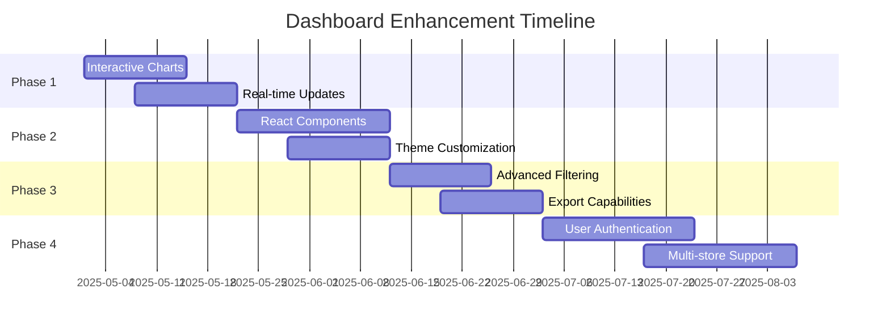

# Dashboard Enhancement Roadmap

## Current State

The Shopify API Monitor Dashboard currently provides a basic HTML/CSS implementation with:

- API status monitoring with a visual gauge
- Usage analytics summary
- Notifications display
- Plan configuration options

The dashboard is framework-agnostic but lacks advanced features like real-time updates, interactive charts, and deep integration with popular frontend frameworks.

## Enhancement Vision

Our vision is to transform the dashboard into a comprehensive, interactive monitoring tool that provides developers with real-time insights and control over their Shopify API usage.

## Phase 1: Core Dashboard Enhancements

### 1.1 Interactive Charts

Replace the placeholder chart with interactive visualizations using Chart.js or D3.js:

- **Usage Over Time**: Line chart showing API usage patterns
- **Request Distribution**: Pie chart of request types
- **Cost Analysis**: Bar chart of operation costs
- **Throttling Events**: Timeline of rate limit events

**Implementation Priority**: High  
**Estimated Effort**: 1 week

### 1.2 Real-time Updates

Implement WebSocket or polling-based updates to provide real-time dashboard data:

- **Live Data Streaming**: Update metrics without page refresh
- **Notification Alerts**: Push new notifications in real-time
- **Rate Limit Warnings**: Immediate visual alerts when approaching limits
- **Connection Status Indicator**: Show when dashboard is actively receiving updates

**Implementation Priority**: High  
**Estimated Effort**: 1 week

### 1.3 Enhanced UI/UX

Improve the overall user experience with:

- **Responsive Design**: Better mobile and tablet support
- **Dark/Light Themes**: Toggle between color schemes
- **Collapsible Sections**: Expand/collapse dashboard sections
- **Tooltips and Hints**: Contextual help for metrics and controls

**Implementation Priority**: Medium  
**Estimated Effort**: 1 week

## Phase 2: Framework Integration

### 2.1 React Components

Create a complete set of React components implementing the dashboard interfaces:

- **Dashboard Container**: Main React component with state management
- **Rate Limit Gauge**: Interactive gauge component
- **Analytics Charts**: Chart components with zoom/filter capabilities
- **Notification System**: Interactive notification components
- **Plan Configuration**: Form components for plan management

**Implementation Priority**: High  
**Estimated Effort**: 2 weeks

### 2.2 Vue.js Integration

Provide Vue.js components for the dashboard:

- **Vue Component Library**: Equivalent to React components
- **Vue-specific State Management**: Integration with Vuex or Pinia
- **Vue Composition API Hooks**: For data fetching and management

**Implementation Priority**: Medium  
**Estimated Effort**: 2 weeks

### 2.3 Angular Integration

Create Angular modules for the dashboard:

- **Angular Component Library**: Dashboard components for Angular
- **Angular Services**: For data fetching and state management
- **Angular Directives**: For specialized dashboard behaviors

**Implementation Priority**: Low  
**Estimated Effort**: 2 weeks

## Phase 3: Advanced Features

### 3.1 Advanced Filtering and Search

Add capabilities to filter and search through API usage data:

- **Time Range Selection**: Filter data by custom time periods
- **Operation Type Filtering**: Focus on specific API operations
- **Cost Thresholds**: Filter by operation cost
- **Full-text Search**: Search across all API operations and results

**Implementation Priority**: Medium  
**Estimated Effort**: 1 week

### 3.2 Data Export and Reporting

Enable exporting dashboard data for external analysis:

- **CSV/JSON Export**: Download raw data in various formats
- **Scheduled Reports**: Generate and email periodic reports
- **PDF Dashboard Export**: Export current dashboard view as PDF
- **Report Templates**: Customizable report formats

**Implementation Priority**: Medium  
**Estimated Effort**: 1 week

### 3.3 Alerting Rules Engine

Create a configurable system for alert conditions:

- **Custom Alert Thresholds**: Set specific limits for notifications
- **Alert Channels**: Configure email, Slack, or webhook notifications
- **Alert Scheduling**: Set quiet hours or working hours for alerts
- **Alert Templates**: Customize notification content

**Implementation Priority**: High  
**Estimated Effort**: 2 weeks

## Phase 4: Enterprise Features

### 4.1 User Authentication and Roles

Implement multi-user access with role-based permissions:

- **User Authentication**: Secure login system
- **Role Management**: Admin, Viewer, and Custom roles
- **Permission Controls**: Granular access to dashboard features
- **Audit Logging**: Track user actions within the dashboard

**Implementation Priority**: Medium  
**Estimated Effort**: 2 weeks

### 4.2 Multi-store Support

Enable monitoring multiple Shopify stores from a single dashboard:

- **Store Switching**: Toggle between different stores
- **Comparative Views**: Side-by-side store metrics
- **Aggregated Reporting**: Combined reports across stores
- **Store-specific Settings**: Custom configurations per store

**Implementation Priority**: High  
**Estimated Effort**: 2 weeks

### 4.3 Advanced Analytics

Implement predictive and prescriptive analytics:

- **Usage Forecasting**: Predict future API usage patterns
- **Anomaly Detection**: Identify unusual API behavior
- **Optimization Suggestions**: Recommendations to reduce API costs
- **Performance Benchmarks**: Compare against industry standards

**Implementation Priority**: Medium  
**Estimated Effort**: 3 weeks

## Phase 5: Integration Ecosystem

### 5.1 Third-party Integrations

Connect the dashboard with external tools and services:

- **Error Tracking**: Integration with Sentry, Rollbar, etc.
- **Performance Monitoring**: New Relic, Datadog integration
- **Business Intelligence**: Export to Tableau, Power BI
- **DevOps Tools**: Integration with monitoring platforms

**Implementation Priority**: Low  
**Estimated Effort**: 2 weeks

### 5.2 Extensibility Framework

Create a plugin system for custom dashboard extensions:

- **Plugin API**: Interface for custom dashboard modules
- **Custom Visualizations**: Framework for adding new chart types
- **Data Processors**: Custom data transformation plugins
- **Theme Extensions**: Custom styling capabilities

**Implementation Priority**: Low  
**Estimated Effort**: 3 weeks

## Implementation Approach

### Technical Considerations

- **Modular Architecture**: Ensure each feature can be developed independently
- **Progressive Enhancement**: Build core features first, then add complexity
- **Backward Compatibility**: Maintain support for existing implementations
- **Performance Optimization**: Ensure dashboard remains responsive with all features

### Development Process

1. **Prototyping**: Create interactive prototypes for major features
2. **User Testing**: Validate designs with actual users
3. **Iterative Development**: Build features incrementally
4. **Continuous Integration**: Automated testing for all components
5. **Documentation**: Update docs alongside feature development

## Success Metrics

We'll measure the success of dashboard enhancements by:

1. **User Engagement**: Time spent using the dashboard
2. **Feature Adoption**: Usage of advanced features
3. **Performance Metrics**: Dashboard load time and responsiveness
4. **User Satisfaction**: Feedback and satisfaction scores
5. **API Efficiency**: Improvements in API usage patterns

## Next Steps

1. **Prioritize Phase 1 Features**: Begin with interactive charts and real-time updates
2. **Create Design Mockups**: Develop detailed UI designs for enhanced dashboard
3. **Technical Spike**: Evaluate charting libraries and WebSocket implementation
4. **Update Documentation**: Ensure all planned features are well-documented

By following this roadmap, we'll transform the Shopify API Monitor Dashboard into a comprehensive, powerful tool for developers to monitor and optimize their Shopify API usage.