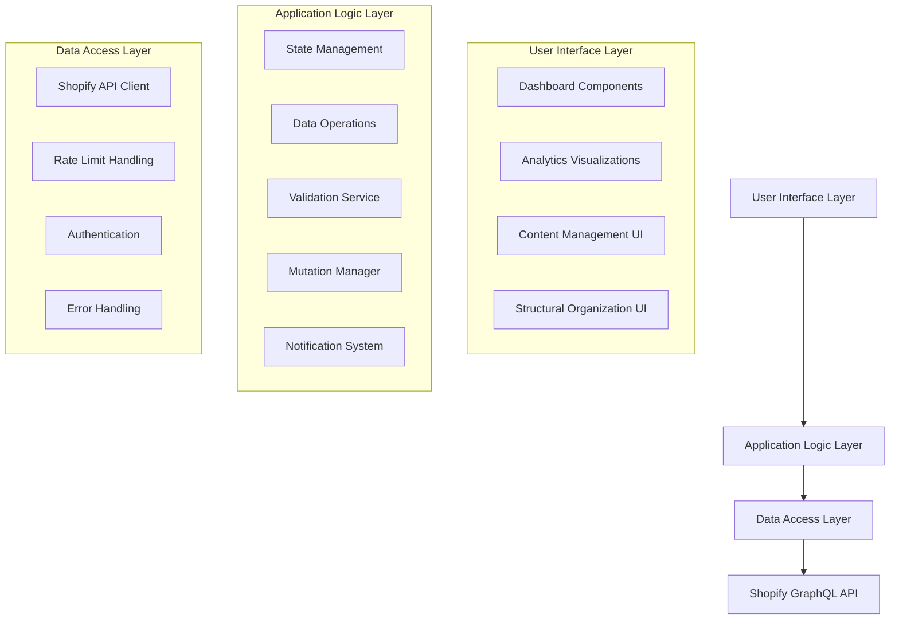

# Comprehensive Shopify Product Ecosystem Management Plan

## 1. Overview

This plan outlines the development of a comprehensive web application management system built on Shopify that will enable you to oversee all development aspects including page creation, product management, content administration, and structural organization. The system will provide both an intuitive dashboard interface and robust API access for programmatic management.

## 2. Shopify Capabilities Assessment

### 2.1 Products, Collections, Inventory, and Transfers

Shopify's GraphQL Admin API provides comprehensive capabilities for managing these core e-commerce elements:

```mermaid
graph TD
    A[Shopify Admin API] --> B[Products & Variants]
    A --> C[Collections]
    A --> D[Inventory]
    A --> E[Transfers]
    A --> F[Content]
    A --> G[Metaobjects]
    A --> H[Files]
    A --> I[Menu Structure]
    
    B --> B1[Create/Update/Delete Products]
    B --> B2[Manage Variants]
    B --> B3[Product Media]
    B --> B4[Product Metafields]
    
    C --> C1[Smart Collections]
    C --> C2[Custom Collections]
    C --> C3[Collection Products]
    
    D --> D1[Inventory Items]
    D --> D2[Inventory Levels]
    D --> D3[Locations]
    
    E --> E1[Create Transfers]
    E --> E2[Accept/Reject Transfers]
    E --> E3[Track Transfer Status]
    
    F --> F1[Pages]
    F --> F2[Blogs & Articles]
    
    G --> G1[Custom Data Structures]
    G --> G2[Metaobject Entries]
    
    H --> H1[File Upload]
    H --> H2[File Management]
    
    I --> I1[Menu Items]
    I --> I2[Menu Structure]
```

### 2.2 Dashboard UI vs API Access

| Component | Dashboard UI | REST API | GraphQL API | Special Considerations |
|-----------|--------------|----------|-------------|------------------------|
| Products | ✅ Full support | ✅ Legacy support | ✅ Preferred method | GraphQL supports >100 variants per product |
| Collections | ✅ Full support | ✅ Legacy support | ✅ Preferred method | Smart vs Custom collections have different capabilities |
| Inventory | ✅ Basic support | ✅ Legacy support | ✅ Preferred method | Multi-location inventory requires Plus plan |
| Transfers | ✅ Basic support | ✅ Legacy support | ✅ Preferred method | Limited to Plus plan |
| Content (Pages/Blogs) | ✅ Full support | ✅ Legacy support | ✅ Preferred method | Online Store 2.0 sections not fully exposed via API |
| Metaobjects | ✅ Full support | ❌ Not supported | ✅ Full support | GraphQL only, newer feature |
| Files | ✅ Full support | ✅ Legacy support | ✅ Preferred method | Size limitations apply |
| Menu Structure | ✅ Full support | ✅ Limited support | ✅ Preferred method | Complex nesting requires careful implementation |

## 3. System Architecture

### 3.1 High-Level Architecture

### 3.2 Component Breakdown

#### 3.2.1 Data Access Layer
- **ShopifyApiClient**: Centralized client for all GraphQL API calls
- **Rate Limit Handling**: Dynamic throttling based on API feedback
- **Authentication**: Support for both Custom App tokens and OAuth
- **Error Handling**: Comprehensive parsing of GraphQL errors

#### 3.2.2 Application Logic Layer
- **State Management**: Efficient caching with data privacy controls
- **Data Operations**: Standardized CRUD operations for all Shopify resources
- **Validation Service**: Data validation before API submission
- **Mutation Manager**: Handles optimistic updates and error recovery
- **Notification System**: In-app alerts for API events and errors

#### 3.2.3 User Interface Layer
- **Dashboard Components**: Analytics and status reporting
- **Content Management UI**: Interface for managing products, collections, content
- **Structural Organization UI**: Visual representation of store structure
- **Analytics Visualizations**: Charts and graphs for data-driven insights

## 4. Implementation Plan

### 4.1 Phase 1: Core Infrastructure (Weeks 1-3)

1. **Setup Project Structure**
   - Initialize Node.js/TypeScript project
   - Configure build tools and linting
   - Set up testing framework

2. **Implement Data Access Layer**
   - Develop ShopifyApiClient with GraphQL support
   - Implement authentication (Custom App token initially)
   - Build rate limit handling with dynamic throttling
   - Create comprehensive error handling

3. **Build Application Logic Foundation**
   - Implement State Management with caching
   - Develop basic Data Operations for core resources
   - Create Validation Service framework
   - Set up Notification System

### 4.2 Phase 2: Product & Inventory Management (Weeks 4-6)

1. **Extend Data Operations**
   - Implement full CRUD for Products and Variants
   - Add support for Product Images and Metafields
   - Build Collection management operations
   - Develop Inventory and Location operations

2. **Create Management UI Components**
   - Build Product listing and detail views
   - Implement Product creation/editing forms
   - Develop Collection management interface
   - Create Inventory management dashboard

3. **Add Bulk Operations Support**
   - Implement Product bulk import/export
   - Add Inventory bulk update capabilities
   - Create Collection bulk management tools

### 4.3 Phase 3: Content & Structure Management (Weeks 7-9)

1. **Extend Data Operations**
   - Implement Pages and Blog Articles operations
   - Add Metaobject definition and entry management
   - Build File upload and management operations
   - Develop Menu structure operations

2. **Create Content Management UI**
   - Build Page and Blog Article editors
   - Implement Metaobject management interface
   - Create File management system
   - Develop Menu builder interface

3. **Add Structural Visualization**
   - Implement store structure visualization using Mermaid
   - Create interactive navigation for structure exploration
   - Build relationship visualization between entities

### 4.4 Phase 4: Dashboard & Analytics (Weeks 10-12)

1. **Implement Analytics Collection**
   - Track content inventory metrics
   - Monitor structural relationships
   - Measure development progress
   - Analyze resource utilization

2. **Build Dashboard UI**
   - Create main dashboard with key metrics
   - Implement actionable insights panels
   - Develop status reporting components
   - Build project progress tracking

3. **Add Decision Support Features**
   - Implement resource allocation recommendations
   - Create development priority suggestions
   - Build content optimization insights

### 4.5 Phase 5: API & Integration Layer (Weeks 13-15)

1. **Develop External API**
   - Create RESTful API endpoints for all operations
   - Implement authentication and authorization
   - Add rate limiting and security measures
   - Build comprehensive API documentation

2. **Add Integration Capabilities**
   - Implement webhook support for external events
   - Create export/import functionality
   - Build integration with external tools
   - Develop extension framework

3. **Finalize Documentation & Testing**
   - Complete user documentation
   - Finalize API documentation
   - Perform comprehensive testing
   - Conduct security audit

## 5. Technical Specifications

### 5.1 Technology Stack

- **Frontend**: React with TypeScript
- **State Management**: Redux or Context API with custom hooks
- **UI Framework**: Material-UI or Tailwind CSS
- **GraphQL Client**: Apollo Client or urql
- **Backend**: Node.js with Express (for API layer)
- **Testing**: Jest, React Testing Library
- **Visualization**: Mermaid.js for structure visualization
- **Charts**: D3.js or Chart.js for analytics

### 5.2 Key Technical Considerations

1. **Rate Limit Management**
   - Implement dynamic throttling based on API feedback
   - Use query cost calculation to optimize requests
   - Implement exponential backoff for retries
   - Consider bulk operations for high-volume tasks

2. **Data Caching Strategy**
   - Cache frequently accessed data
   - Implement cache invalidation on mutations
   - Use optimistic updates for better UX
   - Consider offline capabilities for critical functions

3. **Security Considerations**
   - Secure storage of API credentials
   - Implement proper authentication for the dashboard
   - Add role-based access control
   - Conduct regular security audits

4. **Performance Optimization**
   - Optimize GraphQL queries to minimize cost
   - Implement pagination for large data sets
   - Use virtualization for long lists
   - Consider server-side rendering for initial load

## 6. Potential Challenges & Mitigation Strategies

### 6.1 API Limitations

**Challenge**: Shopify API has rate limits and query cost calculations that can restrict high-volume operations.

**Mitigation**:
- Implement intelligent query batching
- Use bulk operations for large datasets
- Develop adaptive throttling based on API feedback
- Cache frequently accessed data to reduce API calls

### 6.2 Complex Data Relationships

**Challenge**: Managing relationships between products, collections, inventory across locations can be complex.

**Mitigation**:
- Create clear visual representations of relationships
- Implement intuitive UI for relationship management
- Develop validation to prevent invalid relationships
- Build comprehensive documentation

### 6.3 API Evolution

**Challenge**: Shopify regularly updates its API, which may introduce breaking changes.

**Mitigation**:
- Monitor Shopify developer changelog
- Design modular API client that can adapt to changes
- Implement version pinning for stability
- Develop comprehensive testing for API interactions

### 6.4 Dashboard Performance

**Challenge**: Displaying large amounts of data and complex visualizations can impact dashboard performance.

**Mitigation**:
- Implement data aggregation for analytics
- Use pagination and virtualization for large lists
- Optimize rendering of visualizations
- Consider code splitting for dashboard components

## 7. Success Metrics

The success of this implementation will be measured by:

1. **Comprehensive Coverage**: All required Shopify resources can be managed through both UI and API
2. **Operational Efficiency**: Reduction in time spent on manual store management tasks
3. **Data-Driven Insights**: Actionable analytics that improve decision-making
4. **System Performance**: Fast response times and efficient API usage
5. **User Adoption**: Ease of use leading to consistent usage by team members

## 8. Next Steps

To begin implementation, I recommend:

1. **Initial Setup**: Create the project structure and configure the development environment
2. **API Exploration**: Conduct detailed testing of Shopify's GraphQL API capabilities
3. **Prototype Development**: Build a minimal viable product focusing on core data operations
4. **Iterative Enhancement**: Follow the phased approach, gathering feedback at each stage

## 9. Integration with Existing Project

Based on your current project structure, this plan can be integrated with your existing `shopify-api-monitor` project. The components you've already developed (ShopifyApiClient, StateManager, MutationManager, etc.) provide an excellent foundation for the comprehensive management system outlined in this plan.

Your existing components align well with the proposed architecture:
- **ShopifyApiClient**: Already handles GraphQL API communication
- **StateManager**: Provides efficient caching with data privacy controls
- **MutationManager**: Handles optimistic updates and error recovery
- **NotificationSystem**: Provides in-app alerts for API events
- **DataOperations**: Offers standardized CRUD operations for Shopify resources

The next steps would involve extending these components to support all the required Shopify resources and building the dashboard UI to provide actionable analytics and status reports.