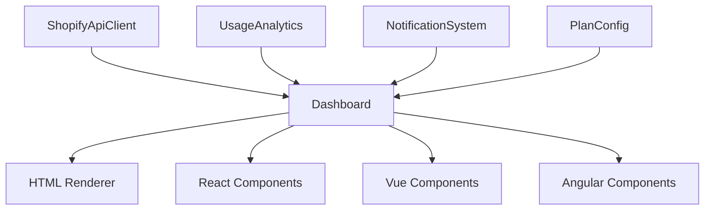

# Shopify API Monitor Dashboard Project Summary

## Project Overview

The Shopify API Monitor Dashboard provides a visual interface for monitoring and managing Shopify API usage, rate limits, and notifications. This document serves as a central reference point for the dashboard implementation, usage, and future development.

## Documentation Index

1. **[Dashboard Implementation Plan](Dashboard_Implementation_Plan.md)**: Step-by-step guide to implement and run the dashboard
2. **[Dashboard Usage Documentation](Dashboard_Usage_Documentation.md)**: How to use and understand the dashboard
3. **[Dashboard Enhancement Roadmap](Dashboard_Enhancement_Roadmap.md)**: Future development plans and feature roadmap

## Current State

The dashboard is currently implemented as a framework-agnostic HTML/CSS interface with the following components:

- **API Status Monitoring**: Visual gauge showing current rate limit usage
- **Usage Analytics**: Summary of API requests, costs, and throttling events
- **Notifications System**: Alerts for rate limit warnings and other events
- **Plan Configuration**: Interface to update Shopify plan settings

The implementation is based on the interfaces and renderer defined in `shopify-api-monitor/src/dashboard/DashboardComponents.ts`.

## Quick Start

To quickly get the dashboard running:

1. Install dependencies:
   ```bash
   cd shopify-api-monitor
   npm install express cors body-parser
   npm install --save-dev @types/express @types/cors @types/body-parser
   ```

2. Create the dashboard server file as outlined in the Implementation Plan

3. Update your Shopify credentials in the server file

4. Add the dashboard script to package.json:
   ```json
   "scripts": {
     "dashboard": "ts-node examples/dashboard-server.ts"
   }
   ```

5. Run the dashboard:
   ```bash
   npm run dashboard
   ```

6. Open your browser to http://localhost:3000

## Architecture

The dashboard follows a modular architecture that separates concerns:



- **Core Components**: Provide the data and functionality
- **Dashboard Interfaces**: Define the component structure
- **Renderers**: Implement the visual representation
- **Framework Integrations**: Provide framework-specific implementations

## Implementation Status

| Component | Status | Notes |
|-----------|--------|-------|
| API Status Gauge | ✅ Complete | Basic implementation with color-coding |
| Usage Analytics | ✅ Complete | Summary cards and table of recent requests |
| Usage Charts | ⚠️ Partial | Placeholder for chart implementation |
| Notifications | ✅ Complete | Display and dismissal of notifications |
| Plan Configuration | ✅ Complete | Plan selection and update functionality |
| React Integration | 🔄 Planned | Part of Phase 2 in the roadmap |
| Real-time Updates | 🔄 Planned | Part of Phase 1 enhancements |

## Key Features to Implement Next

Based on the Enhancement Roadmap, the highest priority features to implement next are:

1. **Interactive Charts**: Replace the chart placeholder with actual visualizations
2. **Real-time Updates**: Implement WebSocket or polling for live data
3. **React Components**: Create React-specific implementations of the dashboard
4. **Enhanced UI/UX**: Improve the overall user experience and responsiveness

## Technical Debt and Considerations

Current technical considerations to address:

1. **Browser Compatibility**: Ensure the dashboard works across all modern browsers
2. **Accessibility**: Improve ARIA support and keyboard navigation
3. **Performance**: Optimize for large datasets and frequent updates
4. **Error Handling**: Enhance error recovery and user feedback

## Integration with Existing Systems

The dashboard integrates with the following components:

- **ShopifyApiClient**: For API requests and rate limit information
- **UsageAnalytics**: For historical usage data and metrics
- **NotificationSystem**: For alerts and messages
- **PlanConfig**: For Shopify plan management
- **StateManager**: For efficient data caching and management

## Development Workflow

For contributing to the dashboard development:

1. **Feature Planning**: Define the feature scope and requirements
2. **Design**: Create mockups and user flows
3. **Implementation**: Develop the feature following the architecture
4. **Testing**: Verify functionality and performance
5. **Documentation**: Update relevant documentation
6. **Review**: Peer review and approval
7. **Release**: Integration into the main codebase

## Resources and References

- **[Shopify API Documentation](https://shopify.dev/api)**: Official Shopify API reference
- **[Express.js Documentation](https://expressjs.com/)**: For the dashboard server
- **[TypeScript Documentation](https://www.typescriptlang.org/docs/)**: For type definitions
- **[Chart.js](https://www.chartjs.org/)**: Recommended for implementing charts
- **[React Documentation](https://reactjs.org/docs/getting-started.html)**: For React integration

## Next Steps

1. **Implement the Dashboard Server**: Follow the implementation plan to create a working dashboard
2. **Gather User Feedback**: Deploy the dashboard and collect user experiences
3. **Prioritize Enhancements**: Refine the roadmap based on user feedback
4. **Begin Phase 1 Development**: Start implementing the highest priority enhancements

By following this project summary and the associated documentation, you'll have a clear understanding of the Shopify API Monitor Dashboard's current state, how to use it, and the path forward for future development.