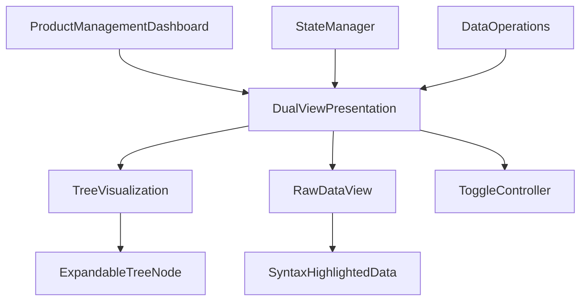

# Dual-View Data Presentation System Design Plan

## Overview

This document outlines the design for a dual-view data presentation system that toggles between an intuitive visual representation (similar to Linux's tree command with ASCII formatting) and the underlying raw data format (JSON, YAML, etc.). This system will be integrated into the Shopify API Monitor dashboard to help developers visualize and understand the application's structure and relationships.

## System Architecture



## Core Components

### 1. DualViewPresentation

This will be the main component responsible for:
- Managing the toggle state between tree and raw data views
- Fetching and transforming data for both views
- Rendering the appropriate view based on user selection

### 2. TreeVisualization

Responsible for:
- Rendering hierarchical data in a tree-like structure
- Implementing expand/collapse functionality
- Displaying relationships between elements
- Supporting both vertical and horizontal scrolling

### 3. RawDataView

Responsible for:
- Displaying the raw data in JSON/YAML format
- Implementing syntax highlighting
- Providing copy functionality
- Supporting search within the data

### 4. ToggleController

A simple UI component that:
- Allows switching between tree and raw data views
- Provides visual indication of the current view
- Includes options for expanding/collapsing all nodes in tree view

## Data Structure

The system will work with the following hierarchical data structure:

```typescript
interface TreeNode {
  id: string;
  name: string;
  type: 'product' | 'collection' | 'page' | 'menu' | 'metaobject' | 'file' | 'inventory' | 'folder';
  children?: TreeNode[];
  data?: any; // Raw data for this node
  expanded?: boolean; // UI state for tree view
  parent?: string; // Parent node ID for relationship visualization
  relationships?: {
    id: string;
    type: string;
    direction: 'to' | 'from' | 'bidirectional';
  }[];
}
```

## Implementation Plan

### Phase 1: Core Components

1. **Create DualViewPresentation Component**
   - Implement basic toggle functionality
   - Set up data fetching and transformation
   - Create container layout with proper scrolling support

2. **Implement TreeVisualization Component**
   - Create expandable tree structure with ASCII formatting
   - Implement expand/collapse functionality
   - Add visual indicators for relationships
   - Support both vertical and horizontal scrolling

3. **Implement RawDataView Component**
   - Create syntax-highlighted view for JSON/YAML
   - Implement copy functionality
   - Add search capability

4. **Create ToggleController Component**
   - Implement toggle button/switch
   - Add expand/collapse all buttons for tree view
   - Create visual indicator for current view

### Phase 2: Integration

1. **Integrate with ProductManagementDashboard**
   - Add DualViewPresentation to the section-content area
   - Update dashboard styles to accommodate the new component
   - Ensure proper responsiveness

2. **Connect with StateManager**
   - Use StateManager for efficient data caching
   - Implement proper data refresh policies

3. **Connect with DataOperations**
   - Fetch hierarchical data using existing data operations
   - Transform data into the required format

### Phase 3: Enhancements

1. **Add Interactive Features**
   - Implement click handling for node details
   - Add hover effects for additional information
   - Create context menu for common actions

2. **Optimize Performance**
   - Implement virtualized rendering for large trees
   - Add lazy loading for expanded nodes
   - Optimize data transformation

3. **Improve Accessibility**
   - Add keyboard navigation
   - Implement proper ARIA attributes
   - Ensure color contrast compliance

## Technical Implementation Details

### TreeVisualization ASCII Formatting

The tree visualization will use ASCII characters to represent the hierarchy:

```
Root
├── Product Category 1
│   ├── Product 1
│   │   └── Variant 1
│   └── Product 2
└── Product Category 2
    ├── Product 3
    └── Product 4
```

### Toggle Mechanism

The toggle will be implemented as a simple switch/button that changes the view state:

```html
<div class="view-toggle">
  <button class="toggle-button tree-view-button active">Tree View</button>
  <button class="toggle-button raw-view-button">Raw Data</button>
</div>
```

### Data Transformation

Data will be transformed from the Shopify API response format to our TreeNode structure:

```typescript
function transformToTreeStructure(data: any): TreeNode[] {
  // Transform logic here
  // This will convert the flat API response into a hierarchical structure
  // with proper parent-child relationships
}
```

### CSS Implementation

Key CSS features will include:

```css
.dual-view-container {
  display: flex;
  flex-direction: column;
  height: 100%;
  overflow: hidden;
}

.view-toggle {
  display: flex;
  justify-content: flex-end;
  padding: 10px;
  border-bottom: 1px solid #eee;
}

.tree-view, .raw-data-view {
  flex: 1;
  overflow: auto;
  padding: 15px;
}

.tree-node {
  font-family: monospace;
  white-space: nowrap;
  cursor: pointer;
}

.node-expander {
  display: inline-block;
  width: 15px;
  text-align: center;
}

.node-content {
  display: inline-block;
}

.node-children {
  padding-left: 20px;
}

.raw-data-view pre {
  margin: 0;
  white-space: pre-wrap;
}

.syntax-highlight {
  /* Syntax highlighting styles */
}
```

## File Structure

```
shopify-api-monitor/
└── src/
    └── dashboard/
        ├── dual-view/
        │   ├── DualViewPresentation.ts
        │   ├── TreeVisualization.ts
        │   ├── RawDataView.ts
        │   ├── ToggleController.ts
        │   └── types.ts
        └── product-management/
            └── ProductManagementDashboard.ts (updated)
```

## Integration with Existing Dashboard

The DualViewPresentation component will be integrated into the ProductManagementDashboard's section-content area:

```typescript
// In ProductManagementDashboard.ts
renderDashboardHTML(props: ProductManagementDashboardProps, metrics: ProductEcosystemMetrics): string {
  // Existing code...
  
  return `
    <div class="product-management-dashboard">
      <!-- Existing header and nav -->
      
      <main class="dashboard-main">
        <div class="section-header">
          <h2>${this.getSectionTitle(activeSection)}</h2>
          <div class="section-actions">
            <button class="create-button">Create ${this.getSectionItemName(activeSection)}</button>
            <button class="refresh-button">Refresh</button>
            <!-- Add dual-view toggle here -->
            <div class="view-mode-toggle">
              <button class="tree-view-toggle active">Tree View</button>
              <button class="raw-view-toggle">Raw Data</button>
            </div>
          </div>
        </div>
        
        <div class="section-content">
          <!-- Dual-view component will be rendered here -->
          ${this.renderDualViewPresentation(activeSection)}
        </div>
      </main>
    </div>
    
    <!-- Existing styles plus new styles for dual-view -->
  `;
}

// New method to render the dual-view component
private renderDualViewPresentation(section: string): string {
  return new DualViewPresentation().render(section);
}
```

## User Interaction Flow

1. User navigates to a section in the ProductManagementDashboard
2. The section content loads with the DualViewPresentation component
3. By default, the tree view is shown with collapsed nodes
4. User can:
   - Toggle between tree and raw data views
   - Expand/collapse individual nodes or all nodes
   - Click on nodes to see details
   - Search within the raw data view
   - Copy raw data to clipboard

## Testing Strategy

1. **Unit Tests**
   - Test data transformation functions
   - Test toggle functionality
   - Test expand/collapse functionality

2. **Integration Tests**
   - Test integration with ProductManagementDashboard
   - Test data fetching and caching with StateManager

3. **Visual Tests**
   - Verify tree rendering with different data structures
   - Verify proper syntax highlighting in raw data view

## Accessibility Considerations

1. Ensure keyboard navigation for all interactive elements
2. Add proper ARIA attributes for tree structure
3. Maintain sufficient color contrast for all elements
4. Provide text alternatives for visual indicators

## Performance Considerations

1. Implement virtualized rendering for large trees
2. Use efficient data transformation algorithms
3. Leverage StateManager for caching
4. Optimize DOM updates during expand/collapse operations

## Implementation Sequence

1. Create the core TypeScript interfaces and types
2. Implement the DualViewPresentation container component
3. Develop the TreeVisualization component with basic functionality
4. Implement the RawDataView component with syntax highlighting
5. Create the ToggleController for switching between views
6. Integrate with ProductManagementDashboard
7. Implement data fetching and transformation
8. Add interactive features and optimizations
9. Test thoroughly and refine based on feedback