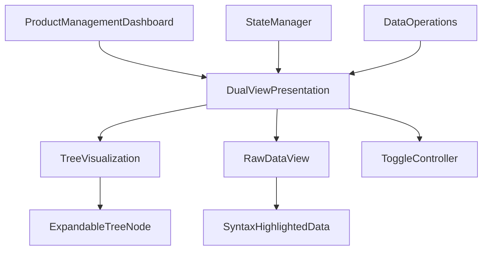

# Dual-View Data Presentation System Summary

## Project Overview

The Dual-View Data Presentation System is a comprehensive visualization tool designed for the Shopify API Monitor dashboard. It provides developers with two complementary views of hierarchical data:

1. **Tree View**: An intuitive visual representation similar to Linux's tree command with ASCII formatting
2. **Raw Data View**: The underlying data in JSON or YAML format

Users can toggle seamlessly between these views, allowing them to understand both the structure and relationships of the data as well as access the raw data for detailed analysis or use in other applications.

## Documentation Index

This project includes the following documentation:

1. **[Design Plan](Dual_View_Data_Presentation_System_Design.md)**: Comprehensive design of the system architecture, components, and implementation plan
2. **[TypeScript Interfaces](Dual_View_Data_Presentation_System_TypeScript_Interfaces.md)**: Detailed TypeScript interfaces for all components and data structures
3. **[Implementation Guide](Dual_View_Data_Presentation_System_Implementation_Guide.md)**: Step-by-step guide for implementing the system with code examples
4. **[User Guide](Dual_View_Data_Presentation_System_User_Guide.md)**: Instructions for end-users on how to use the dual-view system

## Key Features

### Tree Visualization

- Hierarchical display of data relationships
- Expandable/collapsible nodes for focused viewing
- Visual indicators for relationships between elements
- Color-coding for different node types
- Support for both vertical and horizontal scrolling

### Raw Data View

- Syntax-highlighted JSON and YAML formats
- Copy functionality for easy data export
- Search capability for finding specific information
- Format switching between JSON and YAML

### Toggle Mechanism

- Simple UI for switching between views
- Consistent state between views (expanded nodes, etc.)
- Expand/collapse all functionality for tree view

### Integration

- Seamless integration with existing dashboard
- Consistent styling with the rest of the application
- Responsive design for different screen sizes

## Architecture

The system follows a modular architecture with these core components:



## Implementation Approach

The implementation follows a phased approach:

### Phase 1: Core Components
- Create the basic structure and components
- Implement toggle functionality
- Develop tree visualization with ASCII formatting
- Implement raw data view with syntax highlighting

### Phase 2: Integration
- Integrate with ProductManagementDashboard
- Connect with StateManager for data caching
- Implement data transformation from API responses

### Phase 3: Enhancements
- Add interactive features (node details, context menus)
- Optimize performance for large data sets
- Improve accessibility and keyboard navigation

## Data Structure

The system uses a flexible TreeNode interface to represent hierarchical data:

```typescript
interface TreeNode {
  id: string;
  name: string;
  type: 'product' | 'collection' | 'page' | 'menu' | 'metaobject' | 'file' | 'inventory' | 'folder';
  children?: TreeNode[];
  data?: any;
  expanded?: boolean;
  parent?: string;
  relationships?: {
    id: string;
    type: string;
    direction: 'to' | 'from' | 'bidirectional';
  }[];
}
```

## User Experience

The dual-view system enhances the developer experience by:

1. **Improving Comprehension**: Visualizing complex hierarchical relationships
2. **Increasing Efficiency**: Providing both high-level overview and detailed data access
3. **Enhancing Debugging**: Making it easier to identify and troubleshoot data issues
4. **Supporting Different Workflows**: Accommodating both visual and code-oriented developers

## Technical Considerations

### Performance
- Virtualized rendering for large trees
- Efficient data transformation algorithms
- Optimized DOM updates during expand/collapse operations

### Accessibility
- Keyboard navigation for all interactive elements
- ARIA attributes for screen reader support
- Sufficient color contrast for all elements

### Browser Compatibility
- Support for all modern browsers (Chrome, Firefox, Safari, Edge)
- Responsive design for different screen sizes

## Next Steps

1. **Implementation**: Follow the implementation guide to build the system
2. **Testing**: Test with various data structures and user scenarios
3. **Feedback**: Gather user feedback and iterate on the design
4. **Enhancements**: Consider additional features like search, filtering, and export options

## Conclusion

The Dual-View Data Presentation System provides a powerful tool for developers to understand and work with complex hierarchical data in the Shopify API Monitor dashboard. By offering both visual and raw data representations, it caters to different user preferences and use cases, enhancing the overall developer experience.

This comprehensive documentation set provides all the information needed to understand, implement, and use the system effectively.