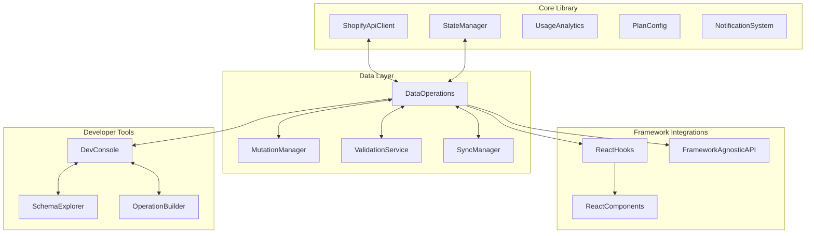

# Front-End and Developer Integration Enhancement Plan

## 1. Current State Analysis

The Shopify API Monitor currently has:
- A solid foundation for monitoring API usage and rate limits
- A framework-agnostic dashboard with basic visualization
- Efficient state management with caching and privacy controls
- Basic examples for usage and state management

However, it lacks:
- Comprehensive CRUD operations for Shopify data types
- React-specific integration components
- Advanced developer controls for data management
- Standardized patterns for data mutations

## 2. Enhancement Goals

### Primary Goals
1. Create a developer-friendly API for React integration while maintaining framework-agnostic options
2. Implement full CRUD operations for all Shopify data types (products, orders, customers, etc.)
3. Provide granular developer control over caching, privacy, and data operations
4. Ensure alignment with Shopify best practices and developer documentation

### Secondary Goals
1. Improve documentation and examples
2. Enhance error handling and validation
3. Optimize performance for high-volume operations
4. Support offline operations and synchronization

## 3. Technical Architecture



## 4. Detailed Implementation Plan

### 4.1 Data Operations Layer

Create a new `DataOperations` module to standardize CRUD operations:

```typescript
// DataOperations.ts
export class DataOperations {
  constructor(
    private apiClient: ShopifyApiClient,
    private stateManager: StateManager
  ) {}

  // Generic query method with type safety
  async query<T>(
    document: string,
    variables?: any,
    options?: Partial<StateRequestOptions>
  ): Promise<T> {
    return this.stateManager.query<T>(document, variables, options);
  }

  // Create operation with validation
  async create<T>(
    resourceType: ShopifyResourceType,
    data: Partial<T>,
    options?: MutationOptions
  ): Promise<T> {
    // Validate data against schema
    this.validateResource(resourceType, data);
    
    // Generate mutation
    const mutation = this.generateMutation('create', resourceType);
    
    // Execute with optimistic updates if enabled
    const result = await this.executeMutation<T>(mutation, { input: data }, options);
    
    // Invalidate relevant cache entries
    this.stateManager.invalidateCache(`${resourceType}-`);
    
    return result;
  }

  // Read operation with advanced filtering
  async read<T>(
    resourceType: ShopifyResourceType,
    options: ReadOptions
  ): Promise<QueryResult<T>> {
    const query = this.generateQuery(resourceType, options);
    return this.query<QueryResult<T>>(query, options.variables, options.cacheOptions);
  }

  // Update operation with partial data
  async update<T>(
    resourceType: ShopifyResourceType,
    id: string,
    data: Partial<T>,
    options?: MutationOptions
  ): Promise<T> {
    // Validate data against schema
    this.validateResource(resourceType, data);
    
    // Generate mutation
    const mutation = this.generateMutation('update', resourceType);
    
    // Execute with optimistic updates if enabled
    const result = await this.executeMutation<T>(
      mutation, 
      { id, input: data },
      options
    );
    
    // Invalidate specific cache entry
    this.stateManager.invalidateCache(`${resourceType}-${id}`);
    
    return result;
  }

  // Delete operation
  async delete(
    resourceType: ShopifyResourceType,
    id: string,
    options?: MutationOptions
  ): Promise<boolean> {
    // Generate mutation
    const mutation = this.generateMutation('delete', resourceType);
    
    // Execute
    const result = await this.executeMutation<{ userErrors: any[] }>(
      mutation,
      { id },
      options
    );
    
    // Invalidate cache entries
    this.stateManager.invalidateCache(`${resourceType}-`);
    
    return result.userErrors.length === 0;
  }

  // Helper methods
  private validateResource(type: ShopifyResourceType, data: any): void {
    // Implementation
  }

  private generateQuery(type: ShopifyResourceType, options: ReadOptions): string {
    // Implementation
  }

  private generateMutation(operation: 'create' | 'update' | 'delete', type: ShopifyResourceType): string {
    // Implementation
  }

  private async executeMutation<T>(
    mutation: string,
    variables: any,
    options?: MutationOptions
  ): Promise<T> {
    // Implementation with optimistic updates
  }
}
```

### 4.2 Mutation Manager

Create a `MutationManager` to handle optimistic updates and error recovery:

```typescript
// MutationManager.ts
export class MutationManager {
  private pendingMutations: Map<string, MutationOperation> = new Map();
  
  constructor(
    private stateManager: StateManager,
    private notificationSystem: NotificationSystem
  ) {}
  
  // Register a mutation with optimistic update
  registerMutation(
    id: string,
    operation: MutationOperation,
    optimisticUpdate?: OptimisticUpdateFunction
  ): void {
    this.pendingMutations.set(id, operation);
    
    // Apply optimistic update if provided
    if (optimisticUpdate) {
      optimisticUpdate(this.stateManager);
    }
  }
  
  // Complete a mutation (success)
  completeMutation(id: string, result: any): void {
    this.pendingMutations.delete(id);
  }
  
  // Fail a mutation (error)
  failMutation(id: string, error: Error): void {
    const operation = this.pendingMutations.get(id);
    
    if (operation?.rollback) {
      // Apply rollback function
      operation.rollback(this.stateManager);
    }
    
    this.pendingMutations.delete(id);
    
    // Notify user
    this.notificationSystem.notify(
      `Operation failed: ${error.message}`,
      'error',
      'system'
    );
  }
  
  // Get pending mutations
  getPendingMutations(): MutationOperation[] {
    return Array.from(this.pendingMutations.values());
  }
}
```

### 4.3 React Integration

Create React-specific hooks and components:

```typescript
// react/hooks.ts
import { useEffect, useState, useCallback } from 'react';
import { ShopifyMonitor, DataOperations, ShopifyResourceType } from '../index';

// Hook for querying data
export function useShopifyQuery<T>(
  monitor: ShopifyMonitor,
  document: string,
  variables?: any,
  options?: QueryHookOptions
): QueryResult<T> {
  const [data, setData] = useState<T | null>(null);
  const [loading, setLoading] = useState<boolean>(true);
  const [error, setError] = useState<Error | null>(null);
  
  useEffect(() => {
    let isMounted = true;
    
    const fetchData = async () => {
      try {
        setLoading(true);
        const result = await monitor.dataOperations.query<T>(
          document,
          variables,
          options
        );
        
        if (isMounted) {
          setData(result);
          setError(null);
        }
      } catch (err) {
        if (isMounted) {
          setError(err as Error);
        }
      } finally {
        if (isMounted) {
          setLoading(false);
        }
      }
    };
    
    fetchData();
    
    // Set up polling if enabled
    let pollingInterval: NodeJS.Timeout | null = null;
    if (options?.pollInterval) {
      pollingInterval = setInterval(fetchData, options.pollInterval);
    }
    
    return () => {
      isMounted = false;
      if (pollingInterval) {
        clearInterval(pollingInterval);
      }
    };
  }, [document, JSON.stringify(variables), options?.pollInterval]);
  
  // Refetch function
  const refetch = useCallback(async () => {
    setLoading(true);
    try {
      const result = await monitor.dataOperations.query<T>(
        document,
        variables,
        { ...options, forceRefresh: true }
      );
      setData(result);
      setError(null);
      return result;
    } catch (err) {
      setError(err as Error);
      throw err;
    } finally {
      setLoading(false);
    }
  }, [document, JSON.stringify(variables)]);
  
  return { data, loading, error, refetch };
}

// Hook for resource CRUD operations
export function useShopifyResource<T>(
  monitor: ShopifyMonitor,
  resourceType: ShopifyResourceType,
  id?: string
): ResourceHookResult<T> {
  const [data, setData] = useState<T | null>(null);
  const [loading, setLoading] = useState<boolean>(id ? true : false);
  const [error, setError] = useState<Error | null>(null);
  
  // Load initial data if ID is provided
  useEffect(() => {
    if (id) {
      fetchResource();
    }
  }, [id, resourceType]);
  
  // Fetch the resource
  const fetchResource = async () => {
    if (!id) return;
    
    setLoading(true);
    try {
      const result = await monitor.dataOperations.read<T>(
        resourceType,
        { id }
      );
      setData(result.data);
      setError(null);
    } catch (err) {
      setError(err as Error);
    } finally {
      setLoading(false);
    }
  };
  
  // Create a new resource
  const createResource = async (input: Partial<T>) => {
    setLoading(true);
    try {
      const result = await monitor.dataOperations.create<T>(
        resourceType,
        input
      );
      setData(result);
      setError(null);
      return result;
    } catch (err) {
      setError(err as Error);
      throw err;
    } finally {
      setLoading(false);
    }
  };
  
  // Update the resource
  const updateResource = async (input: Partial<T>) => {
    if (!id) {
      throw new Error('Cannot update without an ID');
    }
    
    setLoading(true);
    try {
      const result = await monitor.dataOperations.update<T>(
        resourceType,
        id,
        input
      );
      setData(result);
      setError(null);
      return result;
    } catch (err) {
      setError(err as Error);
      throw err;
    } finally {
      setLoading(false);
    }
  };
  
  // Delete the resource
  const deleteResource = async () => {
    if (!id) {
      throw new Error('Cannot delete without an ID');
    }
    
    setLoading(true);
    try {
      const result = await monitor.dataOperations.delete(
        resourceType,
        id
      );
      if (result) {
        setData(null);
      }
      setError(null);
      return result;
    } catch (err) {
      setError(err as Error);
      throw err;
    } finally {
      setLoading(false);
    }
  };
  
  return {
    data,
    loading,
    error,
    create: createResource,
    update: updateResource,
    delete: deleteResource,
    refresh: fetchResource
  };
}
```

### 4.4 Framework-Agnostic API

Enhance the existing API to be more developer-friendly:

```typescript
// Enhanced index.ts
export function createShopifyMonitor(config: ShopifyMonitorConfig): ShopifyMonitor {
  // Create core components
  const apiClient = new ShopifyApiClient({
    shop: config.shop,
    accessToken: config.accessToken,
    plan: config.plan
  });
  
  const stateManager = new StateManager(
    apiClient,
    config.stateManager
  );
  
  const analytics = new UsageAnalytics(
    config.analytics
  );
  
  const planConfig = new PlanConfig({
    initialPlan: config.plan
  });
  
  const notifications = new NotificationSystem(
    config.notifications
  );
  
  // Create new components
  const mutationManager = new MutationManager(
    stateManager,
    notifications
  );
  
  const dataOperations = new DataOperations(
    apiClient,
    stateManager,
    mutationManager
  );
  
  const syncManager = new SyncManager(
    dataOperations,
    stateManager
  );
  
  // Return the complete monitor
  return {
    apiClient,
    stateManager,
    analytics,
    planConfig,
    notifications,
    dataOperations,
    mutationManager,
    syncManager,
    
    // Convenience methods
    query: <T>(document: string, variables?: any, options?: Partial<StateRequestOptions>) => 
      dataOperations.query<T>(document, variables, options),
      
    create: <T>(resourceType: ShopifyResourceType, data: Partial<T>, options?: MutationOptions) => 
      dataOperations.create<T>(resourceType, data, options),
      
    read: <T>(resourceType: ShopifyResourceType, options: ReadOptions) => 
      dataOperations.read<T>(resourceType, options),
      
    update: <T>(resourceType: ShopifyResourceType, id: string, data: Partial<T>, options?: MutationOptions) => 
      dataOperations.update<T>(resourceType, id, data, options),
      
    delete: (resourceType: ShopifyResourceType, id: string, options?: MutationOptions) => 
      dataOperations.delete(resourceType, id, options)
  };
}
```

### 4.5 Developer Tools

Create developer tools for easier integration:

```typescript
// DevConsole.ts
export class DevConsole {
  constructor(private monitor: ShopifyMonitor) {}
  
  // Log API usage
  logApiUsage(): void {
    const summary = this.monitor.analytics.getSummary();
    console.group('Shopify API Usage');
    console.log(`Usage: ${summary.usagePercentage.toFixed(1)}%`);
    console.log(`Points remaining: ${summary.currentStatus?.currentlyAvailable || 0}`);
    console.log(`Throttled requests: ${summary.throttledRequests}`);
    console.groupEnd();
  }
  
  // Log cache stats
  logCacheStats(): void {
    const stats = this.monitor.stateManager.getCacheStats();
    console.group('Cache Statistics');
    console.log(`Total Entries: ${stats.totalEntries}`);
    console.log(`Sanitized Entries: ${stats.sanitizedEntries}`);
    console.log(`Average Access Count: ${stats.averageAccessCount.toFixed(2)}`);
    console.log(`Estimated Cache Size: ${(stats.totalSize / 1024).toFixed(2)} KB`);
    console.groupEnd();
  }
  
  // Log pending mutations
  logPendingMutations(): void {
    const mutations = this.monitor.mutationManager.getPendingMutations();
    console.group('Pending Mutations');
    console.log(`Count: ${mutations.length}`);
    mutations.forEach((m, i) => {
      console.log(`${i + 1}. ${m.type} ${m.resourceType}`);
    });
    console.groupEnd();
  }
  
  // Enable debug mode
  enableDebugMode(): void {
    // Set up listeners for all operations
    // Log detailed information
  }
}
```

### 4.6 Schema Explorer

Create a schema explorer to help developers understand available fields:

```typescript
// SchemaExplorer.ts
export class SchemaExplorer {
  private schema: Map<ShopifyResourceType, ResourceSchema> = new Map();
  
  constructor(private apiClient: ShopifyApiClient) {
    this.initializeSchema();
  }
  
  // Initialize schema definitions
  private async initializeSchema(): Promise<void> {
    // Fetch schema from Shopify or use predefined schemas
    // Parse and store in this.schema
  }
  
  // Get schema for a resource type
  getResourceSchema(type: ShopifyResourceType): ResourceSchema | null {
    return this.schema.get(type) || null;
  }
  
  // Get available fields for a resource
  getAvailableFields(type: ShopifyResourceType): string[] {
    const schema = this.schema.get(type);
    return schema ? Object.keys(schema.fields) : [];
  }
  
  // Get field type information
  getFieldType(type: ShopifyResourceType, field: string): FieldType | null {
    const schema = this.schema.get(type);
    return schema?.fields[field] || null;
  }
  
  // Generate GraphQL fragment for a resource
  generateFragment(
    type: ShopifyResourceType,
    fields?: string[],
    depth: number = 1
  ): string {
    // Implementation
    return '';
  }
}
```

## 5. Implementation Phases

### Phase 1: Core Data Operations Layer
- Implement `DataOperations` class
- Create `MutationManager` for optimistic updates
- Add validation services
- Update existing components to work with new data layer

### Phase 2: React Integration
- Create React hooks for data querying and mutations
- Develop React components for common UI patterns
- Build example React application

### Phase 3: Framework-Agnostic Enhancements
- Improve the core API for better developer experience
- Create adapter pattern for other frameworks
- Enhance documentation with framework-specific examples

### Phase 4: Developer Tools
- Implement DevConsole for debugging
- Create SchemaExplorer for metadata
- Build OperationBuilder for query/mutation generation

### Phase 5: Documentation and Examples
- Create comprehensive documentation
- Develop example applications
- Add interactive tutorials

## 6. Best Practices Implementation

### 6.1 Shopify API Best Practices
- Implement query cost estimation
- Add automatic query optimization
- Support bulk operations for large datasets
- Implement proper error handling for GraphQL errors

### 6.2 Data Privacy Best Practices
- Enhance data sanitization with field-level controls
- Add consent management for data collection
- Implement data retention policies
- Provide audit logging for sensitive operations

### 6.3 Performance Best Practices
- Optimize cache invalidation strategies
- Implement query batching
- Add request deduplication
- Support incremental loading for large datasets

## 7. Success Metrics

- Developer adoption rate
- Reduction in API rate limit issues
- Performance improvements in data operations
- Positive feedback on developer experience

## 8. Risks and Mitigations

| Risk | Mitigation |
|------|------------|
| Complexity of supporting multiple frameworks | Focus on React with clean abstractions for other frameworks |
| Performance impact of additional layers | Implement performance testing and optimization |
| Breaking changes to existing API | Provide migration guides and backward compatibility |
| Shopify API changes | Monitor Shopify developer updates and implement versioning |

## 9. Timeline

| Phase | Estimated Duration |
|-------|-------------------|
| Phase 1: Core Data Operations | 2 weeks |
| Phase 2: React Integration | 2 weeks |
| Phase 3: Framework-Agnostic Enhancements | 1 week |
| Phase 4: Developer Tools | 1 week |
| Phase 5: Documentation and Examples | 2 weeks |
| Total | 8 weeks |

## 10. Conclusion

This plan provides a comprehensive approach to enhancing the front-end experience and developer interaction with the Shopify API Monitor. By focusing on a developer-friendly API for React integration while maintaining framework-agnostic options, implementing full CRUD operations for all Shopify data types, and providing granular developer control over caching and privacy, we can create a powerful and flexible solution that aligns with Shopify best practices.

The implementation will be phased to ensure steady progress and allow for feedback and adjustments along the way. The end result will be a robust library that makes it easy for developers to build Shopify applications with efficient data management and excellent user experiences.