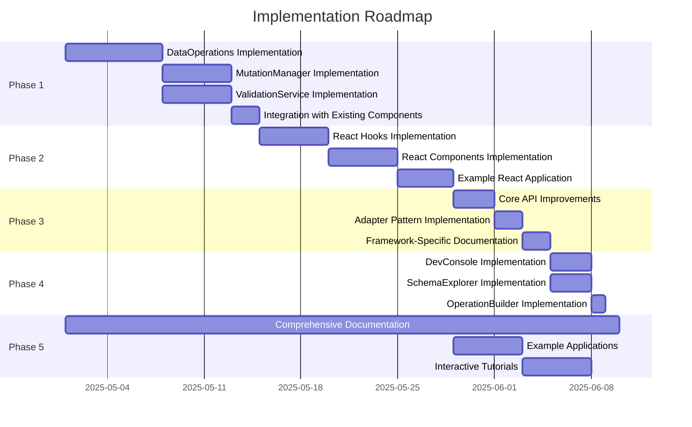

# Implementation Priorities and Roadmap

Based on our comprehensive enhancement plan, here's a detailed breakdown of implementation priorities and a suggested roadmap for execution.

## Priority Assessment

When determining which phases to prioritize, we should consider:

1. **Value to Developers**: Which features will provide the most immediate value to developers?
2. **Technical Dependencies**: Which components need to be built first to support other features?
3. **Complexity vs. Impact**: Which features offer the best balance of implementation effort to developer benefit?
4. **Alignment with Shopify Best Practices**: Which features best align with Shopify's recommended approaches?

## Recommended Implementation Order

### 1. Phase 1: Core Data Operations Layer (Highest Priority)

This phase forms the foundation for all other enhancements and should be implemented first:

- **DataOperations Class**: This is the cornerstone that will enable all CRUD operations
- **MutationManager**: Critical for handling optimistic updates and error recovery
- **ValidationService**: Essential for data integrity and error prevention
- **Integration with Existing Components**: Ensures backward compatibility

**Rationale**: The Data Operations Layer is the foundation that all other enhancements will build upon. It provides the core functionality for CRUD operations while maintaining the existing monitoring capabilities. Without this layer, the React integration and other framework-specific features cannot function properly.

**Timeline**: 2 weeks

**Key Deliverables**:
- Complete DataOperations class with CRUD methods
- MutationManager with optimistic update support
- ValidationService with schema validation
- Updated core components to work with the new data layer
- Unit tests for all new components

### 2. Phase 2: React Integration (High Priority)

Once the data operations layer is in place, React integration should be the next focus:

- **React Hooks**: Implement useShopifyQuery and useShopifyResource hooks
- **React Components**: Create reusable UI components for common patterns
- **Example React Application**: Demonstrate integration in a real-world scenario

**Rationale**: Since the primary focus is on React integration with framework-agnostic options, this phase delivers the most direct value to the target audience. The hooks and components will make it significantly easier for React developers to integrate with Shopify's API while benefiting from the monitoring and rate limit features.

**Timeline**: 2 weeks

**Key Deliverables**:
- Complete set of React hooks for data operations
- Basic set of React components for common UI patterns
- Example React application demonstrating integration
- Documentation for React integration

### 3. Phase 3: Framework-Agnostic Enhancements (Medium Priority)

With React integration complete, expand to support other frameworks:

- **Core API Improvements**: Enhance the developer experience for all frameworks
- **Adapter Pattern**: Create adapters for other popular frameworks
- **Framework-Specific Documentation**: Provide examples for each supported framework

**Rationale**: While React is the primary focus, providing framework-agnostic options ensures broader adoption and flexibility. This phase builds on the core data operations to provide a consistent experience across different frameworks.

**Timeline**: 1 week

**Key Deliverables**:
- Enhanced core API with improved developer experience
- Adapter interfaces for other frameworks
- Documentation with framework-specific examples
- Migration guides for existing users

### 4. Phase 4: Developer Tools (Medium-Low Priority)

Add tools to improve the developer experience:

- **DevConsole**: Implement debugging and monitoring tools
- **SchemaExplorer**: Create tools for exploring Shopify's data schema
- **OperationBuilder**: Build utilities for generating queries and mutations

**Rationale**: Developer tools enhance productivity but are not critical for basic functionality. They provide significant value but can be implemented after the core features are in place.

**Timeline**: 1 week

**Key Deliverables**:
- DevConsole for debugging and monitoring
- SchemaExplorer for metadata exploration
- OperationBuilder for query/mutation generation
- Integration with browser developer tools

### 5. Phase 5: Documentation and Examples (Ongoing Priority)

Documentation should be developed alongside each phase but finalized at the end:

- **Comprehensive Documentation**: Create detailed guides for all features
- **Example Applications**: Develop example applications for common use cases
- **Interactive Tutorials**: Create step-by-step tutorials for key workflows

**Rationale**: While documentation is critical, it should evolve alongside the implementation to ensure accuracy. The final phase focuses on ensuring all features are well-documented with practical examples.

**Timeline**: 2 weeks (with ongoing updates throughout other phases)

**Key Deliverables**:
- Complete API documentation
- Example applications for common use cases
- Interactive tutorials for key workflows
- Best practices guides

## Implementation Approach

### Incremental Development

We recommend an incremental approach with these principles:

1. **Backward Compatibility**: Ensure all changes maintain compatibility with existing code
2. **Feature Flagging**: Use feature flags to enable/disable new features during testing
3. **Continuous Integration**: Implement automated testing for all new components
4. **Regular Releases**: Release smaller, focused updates rather than one large update

### Milestone Planning

| Milestone | Timeline | Key Deliverables |
|-----------|----------|------------------|
| M1: Data Operations Foundation | Week 1-2 | Basic CRUD operations, validation, mutation management |
| M2: React Integration Basics | Week 3-4 | Core React hooks, basic components, example app |
| M3: Framework Support | Week 5 | Framework adapters, enhanced core API |
| M4: Developer Experience | Week 6 | Developer tools, schema explorer |
| M5: Documentation & Examples | Week 7-8 | Complete documentation, examples, tutorials |

### Critical Path Dependencies

## Risk Management

| Risk | Probability | Impact | Mitigation Strategy |
|------|------------|--------|---------------------|
| Breaking changes to existing API | Medium | High | Implement backward compatibility layer, provide migration guides |
| Performance degradation with new layers | Medium | Medium | Implement performance benchmarks, optimize critical paths |
| Complexity of supporting multiple frameworks | Medium | Medium | Focus on React first, use clean abstractions for other frameworks |
| Shopify API changes | Low | High | Monitor Shopify developer updates, implement versioning |

## Success Criteria

We'll measure success by:

1. **Developer Adoption**: Increase in library usage and positive feedback
2. **Performance Metrics**: Improved efficiency in API usage and reduced rate limit issues
3. **Code Quality**: Maintainability and test coverage of new components
4. **Documentation Quality**: Comprehensiveness and clarity of documentation

## Next Steps

1. **Finalize Phase 1 Specifications**: Define detailed specifications for the Data Operations Layer
2. **Set Up Development Environment**: Prepare development environment with testing infrastructure
3. **Create Initial Prototypes**: Develop prototypes for key components to validate approach
4. **Establish Feedback Mechanisms**: Set up channels for developer feedback during implementation

By following this prioritized implementation plan, we can deliver the most valuable features first while building a solid foundation for future enhancements.