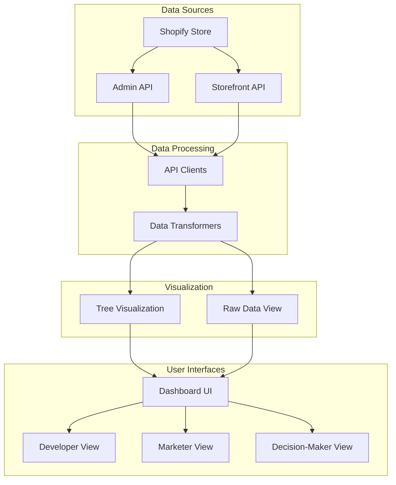
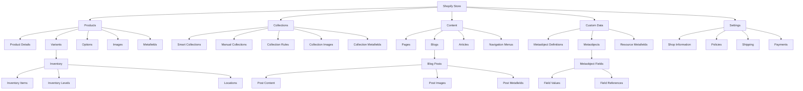

# Shopify Dashboard Data Plan

## Overview

This document outlines a comprehensive plan for a dashboard that visualizes the complete Shopify store hierarchy using data accessible through the Shopify Admin API and Storefront API. The dashboard will:

1. Present both visual representations and raw data side-by-side
2. Eliminate the need for navigating through admin.shopify.com
3. Include actionable insights and edit capabilities for common tasks
4. Show contextual relationships between store elements
5. Organize information in logical sections with drill-down functionality
6. Serve the needs of both developers and marketers

## Data Sources and API Endpoints

### Admin API Data Sources

The Shopify Admin API provides access to the following key resources that we can leverage:

1. **Products & Variants**
   - Complete product catalog with variants, options, images
   - Inventory levels and availability
   - Product organization (collections, tags)
   - Pricing information

2. **Collections**
   - Smart and manual collections
   - Collection rules and conditions
   - Products within collections

3. **Orders & Fulfillment**
   - Order status and history
   - Fulfillment status
   - Shipping information

4. **Inventory**
   - Inventory levels across locations
   - Inventory adjustments
   - Inventory policies

5. **Content**
   - Pages
   - Blog posts
   - Navigation menus

6. **Store Settings**
   - Shop information
   - Policies
   - Shipping zones
   - Payment methods

7. **Metafields & Metaobjects**
   - Custom metadata for products, collections, etc.
   - Structured content via metaobjects

8. **Files**
   - Images
   - Documents
   - Videos

9. **API Usage**
   - Rate limits
   - Query costs
   - Available/used resources

### Storefront API Data Sources

The Storefront API provides access to customer-facing data:

1. **Products & Collections**
   - Product details as seen by customers
   - Collection organization
   - Product availability

2. **Content**
   - Pages
   - Blog articles
   - Menus

3. **Shop Information**
   - Policies
   - Contact information

## Dashboard Sections and Data Organization

Based on the available data, I propose organizing the dashboard into the following sections:

### 1. Store Overview

**Purpose:** Provide a high-level view of the store's structure and health

**Data Elements:**
- Total products, collections, pages, blog posts
- API usage metrics and rate limit status
- Recent updates across the store
- Store health indicators (inventory alerts, out-of-stock products)

**API Endpoints:**
- Admin API: Shop, Products (count), Collections (count), etc.
- Admin API: GraphQL cost information

**Visual Representation:**
- Store structure tree view
- API usage graphs
- Status indicators

### 2. Product Ecosystem

**Purpose:** Comprehensive view of products, variants, collections, and inventory

**Data Elements:**
- Product hierarchy with variants
- Collection organization
- Inventory levels across locations
- Product relationships and organization

**API Endpoints:**
- Admin API: Products, Variants, Collections, InventoryItems, InventoryLevels
- Storefront API: Products, Collections

**Visual Representation:**
- Product hierarchy tree
- Collection membership visualization
- Inventory status indicators
- Product relationship graph

### 3. Content Management

**Purpose:** Visualize and manage content pages, blog posts, and navigation

**Data Elements:**
- Pages structure
- Blog posts organization
- Navigation menus
- Content relationships

**API Endpoints:**
- Admin API: Pages, Articles, Blogs, Menu
- Storefront API: Pages, Articles, Menu

**Visual Representation:**
- Content structure tree
- Navigation menu visualization
- Content relationship graph

### 4. Custom Data & Metafields

**Purpose:** Visualize custom data structures and metafields

**Data Elements:**
- Metaobject definitions and entries
- Metafields across different resources
- Custom data relationships

**API Endpoints:**
- Admin API: MetaobjectDefinitions, Metaobjects, Metafields
- Storefront API: Metaobjects, Metafields

**Visual Representation:**
- Metaobject structure tree
- Metafield organization by namespace/key
- Custom data relationship visualization

### 5. API Usage & Developer Tools

**Purpose:** Monitor API usage, rate limits, and provide developer-focused tools

**Data Elements:**
- Current API usage and rate limits
- Historical API usage patterns
- Query cost analysis
- GraphQL query builder

**API Endpoints:**
- Admin API: GraphQL cost information
- Throttle status from API responses

**Visual Representation:**
- API usage graphs
- Rate limit visualizations
- Query cost breakdown

## Detailed Data Requirements by Section

### 1. Store Overview

#### Admin API Queries

```graphql
# Shop Information
query ShopInfo {
  shop {
    id
    name
    email
    myshopifyDomain
    primaryDomain {
      url
      host
    }
    plan {
      displayName
      partnerDevelopment
      shopifyPlus
    }
    features {
      storefront
      giftCards
      multiLocation
    }
    billingAddress {
      formatted
      country
      city
    }
    currencyCode
    weightUnit
  }
}

# Store Counts
query StoreCounts {
  products {
    totalCount
  }
  collections {
    totalCount
  }
  pages {
    totalCount
  }
  blogs {
    edges {
      node {
        articles {
          totalCount
        }
      }
    }
    totalCount
  }
  locations {
    totalCount
  }
  metaobjectDefinitions {
    totalCount
  }
  files {
    totalCount
  }
  menus {
    totalCount
  }
}
```

#### Storefront API Queries

```graphql
# Shop Information (Public)
query StorefrontShopInfo {
  shop {
    name
    description
    primaryDomain {
      url
    }
    brand {
      logo {
        image {
          url
        }
      }
      colors {
        primary {
          background
          foreground
        }
      }
    }
  }
}
```

### 2. Product Ecosystem

#### Admin API Queries

```graphql
# Products with Variants and Inventory
query ProductsWithVariantsAndInventory($first: Int!, $after: String) {
  products(first: $first, after: $after) {
    edges {
      node {
        id
        title
        handle
        description
        descriptionHtml
        productType
        tags
        vendor
        status
        createdAt
        updatedAt
        publishedAt
        options {
          id
          name
          position
          values
        }
        priceRangeV2 {
          minVariantPrice {
            amount
            currencyCode
          }
          maxVariantPrice {
            amount
            currencyCode
          }
        }
        images(first: 10) {
          edges {
            node {
              id
              url
              altText
              width
              height
            }
          }
        }
        variants(first: 100) {
          edges {
            node {
              id
              title
              sku
              price
              compareAtPrice
              inventoryQuantity
              inventoryItem {
                id
                inventoryLevels(first: 10) {
                  edges {
                    node {
                      id
                      available
                      location {
                        id
                        name
                      }
                    }
                  }
                }
              }
              selectedOptions {
                name
                value
              }
              image {
                id
                url
              }
            }
          }
        }
        metafields(first: 20) {
          edges {
            node {
              id
              namespace
              key
              value
              type
            }
          }
        }
        collections(first: 10) {
          edges {
            node {
              id
              title
              handle
            }
          }
        }
      }
    }
    pageInfo {
      hasNextPage
      endCursor
    }
  }
}

# Collections with Products
query CollectionsWithProducts($first: Int!, $after: String) {
  collections(first: $first, after: $after) {
    edges {
      node {
        id
        title
        handle
        description
        descriptionHtml
        updatedAt
        ruleSet {
          rules {
            column
            condition
            relation
          }
          appliedDisjunctively
        }
        image {
          id
          url
          altText
        }
        products(first: 50) {
          edges {
            node {
              id
              title
              handle
            }
          }
          pageInfo {
            hasNextPage
            endCursor
          }
        }
        metafields(first: 20) {
          edges {
            node {
              id
              namespace
              key
              value
              type
            }
          }
        }
      }
    }
    pageInfo {
      hasNextPage
      endCursor
    }
  }
}

# Inventory Levels
query InventoryLevels($first: Int!, $after: String) {
  locations(first: 10) {
    edges {
      node {
        id
        name
        address {
          formatted
        }
        isActive
        inventoryLevels(first: $first, after: $after) {
          edges {
            node {
              id
              available
              item {
                id
                sku
                variant {
                  id
                  displayName
                  product {
                    id
                    title
                  }
                }
              }
            }
          }
          pageInfo {
            hasNextPage
            endCursor
          }
        }
      }
    }
  }
}
```

#### Storefront API Queries

```graphql
# Products for Storefront
query StorefrontProducts($first: Int!, $after: String) {
  products(first: $first, after: $after) {
    edges {
      node {
        id
        title
        handle
        description
        productType
        tags
        vendor
        availableForSale
        options {
          name
          values
        }
        priceRange {
          minVariantPrice {
            amount
            currencyCode
          }
          maxVariantPrice {
            amount
            currencyCode
          }
        }
        images(first: 5) {
          edges {
            node {
              id
              url
              altText
            }
          }
        }
        variants(first: 100) {
          edges {
            node {
              id
              title
              availableForSale
              quantityAvailable
              price {
                amount
                currencyCode
              }
              compareAtPrice {
                amount
                currencyCode
              }
              selectedOptions {
                name
                value
              }
            }
          }
        }
        collections(first: 5) {
          edges {
            node {
              id
              title
              handle
            }
          }
        }
      }
    }
    pageInfo {
      hasNextPage
      endCursor
    }
  }
}

# Collections for Storefront
query StorefrontCollections($first: Int!, $after: String) {
  collections(first: $first, after: $after) {
    edges {
      node {
        id
        title
        handle
        description
        image {
          url
          altText
        }
        products(first: 10) {
          edges {
            node {
              id
              title
              handle
            }
          }
          pageInfo {
            hasNextPage
            endCursor
          }
        }
      }
    }
    pageInfo {
      hasNextPage
      endCursor
    }
  }
}
```

### 3. Content Management

#### Admin API Queries

```graphql
# Pages
query Pages($first: Int!, $after: String) {
  pages(first: $first, after: $after) {
    edges {
      node {
        id
        title
        handle
        bodySummary
        body
        bodyHtml
        createdAt
        updatedAt
        publishedAt
        onlineStoreUrl
        seo {
          title
          description
        }
        metafields(first: 10) {
          edges {
            node {
              id
              namespace
              key
              value
              type
            }
          }
        }
      }
    }
    pageInfo {
      hasNextPage
      endCursor
    }
  }
}

# Blogs and Articles
query BlogsAndArticles($first: Int!, $after: String) {
  blogs(first: 10) {
    edges {
      node {
        id
        title
        handle
        onlineStoreUrl
        articles(first: $first, after: $after) {
          edges {
            node {
              id
              title
              handle
              content
              contentHtml
              excerpt
              excerptHtml
              publishedAt
              onlineStoreUrl
              tags
              image {
                id
                url
                altText
              }
              seo {
                title
                description
              }
              metafields(first: 10) {
                edges {
                  node {
                    id
                    namespace
                    key
                    value
                    type
                  }
                }
              }
            }
          }
          pageInfo {
            hasNextPage
            endCursor
          }
        }
      }
    }
  }
}

# Navigation Menus
query NavigationMenus {
  menus(first: 10) {
    edges {
      node {
        id
        title
        handle
        items {
          id
          title
          url
          type
          items {
            id
            title
            url
            type
            items {
              id
              title
              url
              type
            }
          }
        }
      }
    }
  }
}
```

#### Storefront API Queries

```graphql
# Pages for Storefront
query StorefrontPages($first: Int!, $after: String) {
  pages(first: $first, after: $after) {
    edges {
      node {
        id
        title
        handle
        body
        bodySummary
        createdAt
        updatedAt
      }
    }
    pageInfo {
      hasNextPage
      endCursor
    }
  }
}

# Blog Articles for Storefront
query StorefrontBlogArticles($first: Int!, $after: String) {
  blogs(first: 10) {
    edges {
      node {
        id
        title
        handle
        articles(first: $first, after: $after) {
          edges {
            node {
              id
              title
              handle
              content
              excerpt
              publishedAt
              image {
                url
                altText
              }
              tags
            }
          }
          pageInfo {
            hasNextPage
            endCursor
          }
        }
      }
    }
  }
}

# Menu for Storefront
query StorefrontMenu($handle: String!) {
  menu(handle: $handle) {
    id
    items {
      id
      title
      url
      items {
        id
        title
        url
        items {
          id
          title
          url
        }
      }
    }
  }
}
```

### 4. Custom Data & Metafields

#### Admin API Queries

```graphql
# Metaobject Definitions
query MetaobjectDefinitions($first: Int!, $after: String) {
  metaobjectDefinitions(first: $first, after: $after) {
    edges {
      node {
        id
        name
        type
        description
        fieldDefinitions {
          key
          name
          description
          required
          type {
            name
          }
        }
      }
    }
    pageInfo {
      hasNextPage
      endCursor
    }
  }
}

# Metaobjects
query Metaobjects($type: String!, $first: Int!, $after: String) {
  metaobjects(type: $type, first: $first, after: $after) {
    edges {
      node {
        id
        handle
        type
        fields {
          key
          value
          type
          definition {
            name
            description
          }
          references(first: 10) {
            edges {
              node {
                ... on Product {
                  id
                  title
                }
                ... on Collection {
                  id
                  title
                }
                ... on Metaobject {
                  id
                  handle
                  type
                }
              }
            }
          }
        }
      }
    }
    pageInfo {
      hasNextPage
      endCursor
    }
  }
}

# Resource Metafields
query ResourceMetafields($ownerId: ID!, $first: Int!, $after: String) {
  metafields(ownerId: $ownerId, first: $first, after: $after) {
    edges {
      node {
        id
        namespace
        key
        value
        type
        description
        createdAt
        updatedAt
      }
    }
    pageInfo {
      hasNextPage
      endCursor
    }
  }
}
```

#### Storefront API Queries

```graphql
# Metaobjects for Storefront
query StorefrontMetaobjects($type: String!, $first: Int!, $after: String) {
  metaobjects(type: $type, first: $first, after: $after) {
    edges {
      node {
        id
        handle
        type
        fields {
          key
          value
          type
          reference {
            ... on Product {
              id
              title
              handle
            }
            ... on Collection {
              id
              title
              handle
            }
            ... on Metaobject {
              id
              handle
              type
            }
          }
        }
      }
    }
    pageInfo {
      hasNextPage
      endCursor
    }
  }
}
```

### 5. API Usage & Developer Tools

#### Admin API Queries

```graphql
# API Usage Information
query ApiUsageInformation {
  shop {
    id
    name
    apiVersion
  }
  # The cost information will be available in the response extensions
}
```

## Data Visualization and Presentation

For each section of the dashboard, we'll implement dual-view visualization:

### Tree View Visualization

The tree view will provide a hierarchical representation of the store structure:

1. **Products Hierarchy**
   - Products → Variants → Options
   - Products → Collections
   - Products → Inventory (by location)

2. **Content Hierarchy**
   - Pages
   - Blogs → Articles
   - Navigation → Menu Items

3. **Custom Data Hierarchy**
   - Metaobject Definitions → Metaobjects
   - Resource → Metafields (by namespace)

### Raw Data View

The raw data view will display the complete API response data in a structured format:

1. **JSON Viewer**
   - Collapsible nodes
   - Syntax highlighting
   - Search functionality

2. **Table View**
   - Sortable columns
   - Filterable data
   - Pagination

## Implementation Approach

To implement this dashboard, we'll need to:

1. **Extend Existing API Clients**
   - Add support for all required Admin API and Storefront API endpoints
   - Implement caching for improved performance
   - Add rate limit monitoring and throttling

2. **Create Data Transformers**
   - Transform API responses into hierarchical structures for tree visualization
   - Create normalized data structures for table views
   - Implement relationship mapping between different resources

3. **Develop Visualization Components**
   - Enhance the existing dual-view system
   - Create specialized visualizations for different data types
   - Implement interactive elements for drill-down functionality

4. **Implement User Role Views**
   - Developer-focused view with technical details
   - Marketer-focused view with content and product organization
   - Decision-maker view with high-level store structure

## Dashboard Data Flow



## Store Data Structure



## Conclusion

This comprehensive plan outlines the data to be included in the dashboard, focusing exclusively on information accessible via the Shopify Admin API and Storefront API while strictly excluding any sensitive customer data. The dashboard will provide a complete visualization of the Shopify store hierarchy, with both visual representations and raw data side-by-side, organized in logical sections with drill-down functionality.

By implementing this plan, we'll create a powerful tool that eliminates the need for navigating through admin.shopify.com, provides actionable insights, and shows contextual relationships between store elements, serving the needs of developers, marketers, and decision-makers.