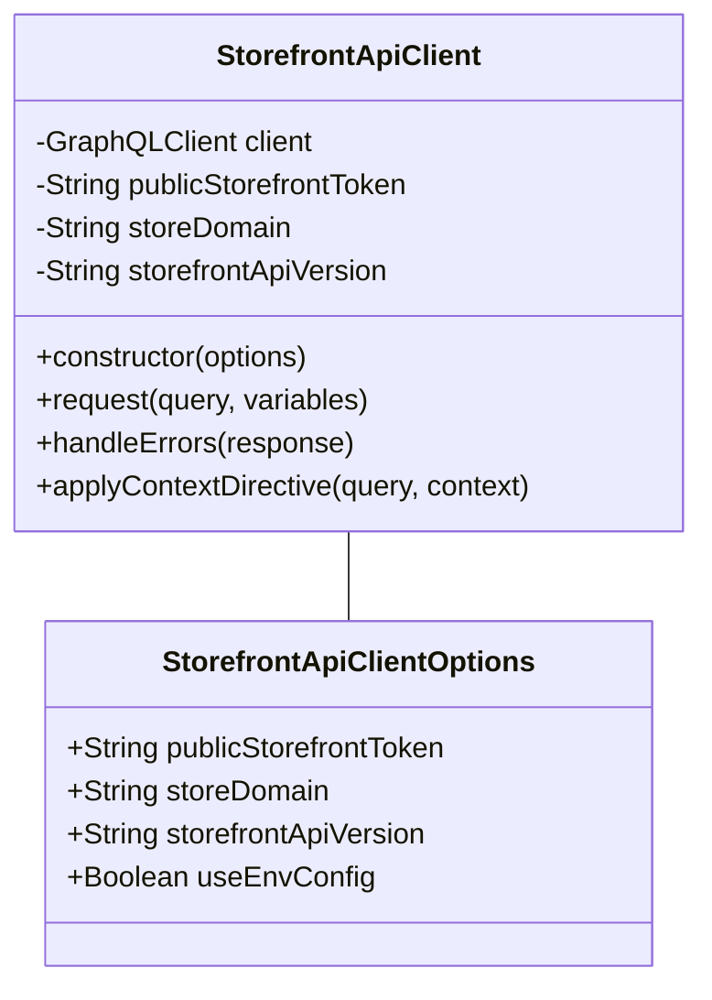
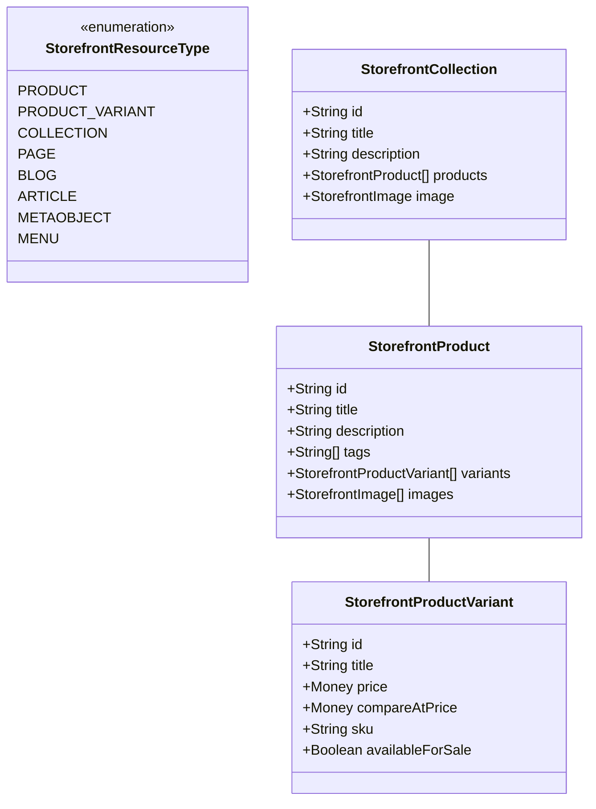
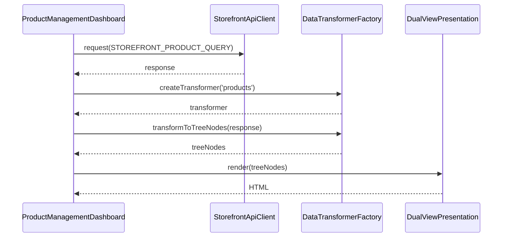
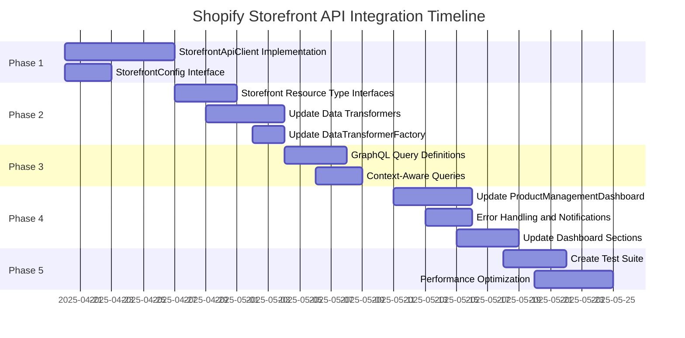

# Shopify Storefront API Integration Plan

## 1. Overview

This implementation plan addresses the misalignments identified between our dashboard implementation and the Shopify Storefront API. The plan is structured into phases with clear deliverables and timelines to ensure a systematic approach to aligning our dashboard with the API's capabilities.

## 2. Phase 1: Storefront API Client Implementation (Week 1)

### 2.1 Create StorefrontApiClient Class



#### Key Implementation Details:

1. **Authentication Implementation**:
   - Support for public access token (required for browser-based access)
   - Support for private access token (for server-side operations)
   - Environment variable configuration via ConfigManager

2. **GraphQL Query Construction**:
   - Proper formatting of GraphQL queries
   - Support for operation names
   - Variables handling

3. **Directive Support**:
   - Implementation of `@inContext` directive for country/language context
   - Support for buyer identity context

4. **Error Handling**:
   - Processing of GraphQL errors (200 OK with error objects)
   - Handling of 430 security rejections
   - Retry logic with exponential backoff

### 2.2 Create StorefrontConfig Interface

```typescript
export interface StorefrontConfig {
  /**
   * Shopify store domain (e.g., 'your-store.myshopify.com')
   */
  storeDomain: string;
  
  /**
   * Public Storefront API token for client-side access
   */
  publicStorefrontToken: string;
  
  /**
   * Private Storefront API token for server-side access (optional)
   */
  privateStorefrontToken?: string;
  
  /**
   * Storefront API version (e.g., '2025-04')
   * @default 'latest'
   */
  storefrontApiVersion?: string;
  
  /**
   * Context settings for the Storefront API
   */
  context?: {
    /**
     * Country code for localization
     */
    country?: string;
    
    /**
     * Language code for localization
     */
    language?: string;
    
    /**
     * Buyer identity information
     */
    buyerIdentity?: {
      customerAccessToken?: string;
      email?: string;
      phone?: string;
      countryCode?: string;
    };
  };
}
```

## 3. Phase 2: Data Structure Alignment (Week 2)

### 3.1 Create Storefront Resource Type Interfaces



### 3.2 Update Data Transformers

Create specialized transformers for each resource type that properly handle the Storefront API's data structure:

1. **StorefrontProductsTransformer**:
   - Transform product data from Storefront API format to TreeNode format
   - Handle product variants correctly
   - Support for product images, options, and other attributes

2. **StorefrontCollectionsTransformer**:
   - Transform collection data from Storefront API format to TreeNode format
   - Handle collection-product relationships

3. **StorefrontContentTransformer**:
   - Transform pages, blogs, and articles data
   - Handle content relationships

4. **StorefrontMetaobjectsTransformer**:
   - Transform metaobject data
   - Handle metaobject field types correctly

### 3.3 Update DataTransformerFactory

```typescript
export class StorefrontDataTransformerFactory implements DataTransformerFactory {
  createTransformer(section: string): DataTransformer {
    switch (section) {
      case 'products':
        return new StorefrontProductsTransformer();
      case 'collections':
        return new StorefrontCollectionsTransformer();
      case 'content':
        return new StorefrontContentTransformer();
      case 'metaobjects':
        return new StorefrontMetaobjectsTransformer();
      // Add other transformers as needed
      default:
        throw new Error(`No transformer available for section: ${section}`);
    }
  }
}
```

## 4. Phase 3: Query Definition and Implementation (Week 3)

### 4.1 Create GraphQL Query Definitions

Create a set of GraphQL query definitions for each resource type:

```typescript
export const STOREFRONT_PRODUCT_QUERY = `#graphql
  query products($first: Int!, $after: String) {
    products(first: $first, after: $after) {
      edges {
        node {
          id
          title
          description
          tags
          variants(first: 250) {
            edges {
              node {
                id
                title
                price {
                  amount
                  currencyCode
                }
                compareAtPrice {
                  amount
                  currencyCode
                }
                sku
                availableForSale
              }
            }
          }
          images(first: 10) {
            edges {
              node {
                id
                url
                altText
                width
                height
              }
            }
          }
        }
      }
      pageInfo {
        hasNextPage
        endCursor
      }
    }
  }
`;

export const STOREFRONT_COLLECTION_QUERY = `#graphql
  query collections($first: Int!, $after: String) {
    collections(first: $first, after: $after) {
      edges {
        node {
          id
          title
          description
          image {
            id
            url
            altText
          }
          products(first: 10) {
            edges {
              node {
                id
                title
              }
            }
          }
        }
      }
      pageInfo {
        hasNextPage
        endCursor
      }
    }
  }
`;

// Add other queries for different resource types
```

### 4.2 Implement Context-Aware Queries

Add support for context-aware queries using the `@inContext` directive:

```typescript
export function applyContextToQuery(query: string, context?: StorefrontContext): string {
  if (!context) {
    return query;
  }
  
  const contextDirective = [];
  
  if (context.country) {
    contextDirective.push(`country: ${context.country}`);
  }
  
  if (context.language) {
    contextDirective.push(`language: ${context.language}`);
  }
  
  if (contextDirective.length === 0) {
    return query;
  }
  
  // Insert @inContext directive after the query keyword
  return query.replace(
    /query\s+([a-zA-Z0-9_]*)/,
    `query $1 @inContext(${contextDirective.join(', ')})`
  );
}
```

## 5. Phase 4: Dashboard Integration (Week 4)

### 5.1 Update ProductManagementDashboard



1. **Update Constructor**:
   - Accept StorefrontApiClient instead of ShopifyApiClient
   - Add support for context configuration

2. **Update fetchMetrics Method**:
   - Use Storefront API queries to fetch accurate metrics
   - Handle pagination for large datasets

3. **Update renderDashboardHTML Method**:
   - Ensure sections align with Storefront API capabilities
   - Update section titles and item names

### 5.2 Implement Error Handling and Notifications

1. **Add Comprehensive Error Handling**:
   - Handle GraphQL errors (200 OK with error objects)
   - Handle network errors
   - Handle authentication errors

2. **Update NotificationSystem**:
   - Add specific error messages for Storefront API errors
   - Provide user-friendly error messages

### 5.3 Update Dashboard Sections

Review and update each dashboard section to ensure it aligns with Storefront API capabilities:

1. **Products Section**:
   - Ensure product data structure matches Storefront API
   - Update product actions to use Storefront API mutations

2. **Collections Section**:
   - Ensure collection data structure matches Storefront API
   - Update collection-product relationships

3. **Content Section**:
   - Verify pages, blogs, and articles data structure
   - Update content actions

4. **Metaobjects Section**:
   - Verify metaobject data structure
   - Update metaobject actions

5. **Remove or Modify Unsupported Sections**:
   - Identify sections not supported by Storefront API
   - Either remove or modify them to work with available data

## 6. Phase 5: Testing and Optimization (Week 5)

### 6.1 Create Test Suite

1. **Unit Tests**:
   - Test StorefrontApiClient
   - Test data transformers
   - Test query construction

2. **Integration Tests**:
   - Test dashboard with mock API responses
   - Test error handling

3. **End-to-End Tests**:
   - Test dashboard with real Storefront API
   - Test performance with large datasets

### 6.2 Performance Optimization

1. **Query Optimization**:
   - Optimize GraphQL queries to request only needed fields
   - Implement pagination for large datasets

2. **Caching Strategy**:
   - Implement client-side caching for frequently accessed data
   - Add cache invalidation on mutations

3. **Rendering Optimization**:
   - Optimize tree rendering for large datasets
   - Implement virtualization for long lists

## 7. Implementation Timeline



## 8. Deliverables

1. **StorefrontApiClient Class**:
   - Complete implementation with authentication, query construction, and error handling
   - Documentation and usage examples

2. **Updated Data Transformers**:
   - Specialized transformers for each resource type
   - Documentation of transformation logic

3. **GraphQL Query Definitions**:
   - Complete set of queries for all supported resource types
   - Context-aware query utilities

4. **Updated Dashboard**:
   - ProductManagementDashboard with Storefront API integration
   - Updated sections and actions

5. **Test Suite**:
   - Comprehensive tests for all components
   - Performance benchmarks

6. **Documentation**:
   - API integration guide
   - Dashboard usage documentation
   - Troubleshooting guide

## 9. Risks and Mitigation

| Risk | Impact | Mitigation |
|------|--------|------------|
| Storefront API rate limits | Could cause dashboard to fail during heavy usage | Implement caching, rate limit monitoring, and backoff strategy |
| API version changes | Could break dashboard functionality | Design version-aware client, monitor Shopify changelog |
| Missing capabilities in Storefront API | Some dashboard features may not be possible | Clearly document limitations, provide alternative workflows |
| Performance with large datasets | Dashboard could become slow | Implement pagination, virtualization, and optimized queries |
| Authentication complexity | Security issues or token expiration | Implement proper token management and refresh logic |

## 10. Conclusion

This implementation plan provides a comprehensive approach to aligning our dashboard with the Shopify Storefront API. By following this plan, we will create a robust, efficient, and accurate dashboard that leverages the full capabilities of the Storefront API while addressing the current misalignments.