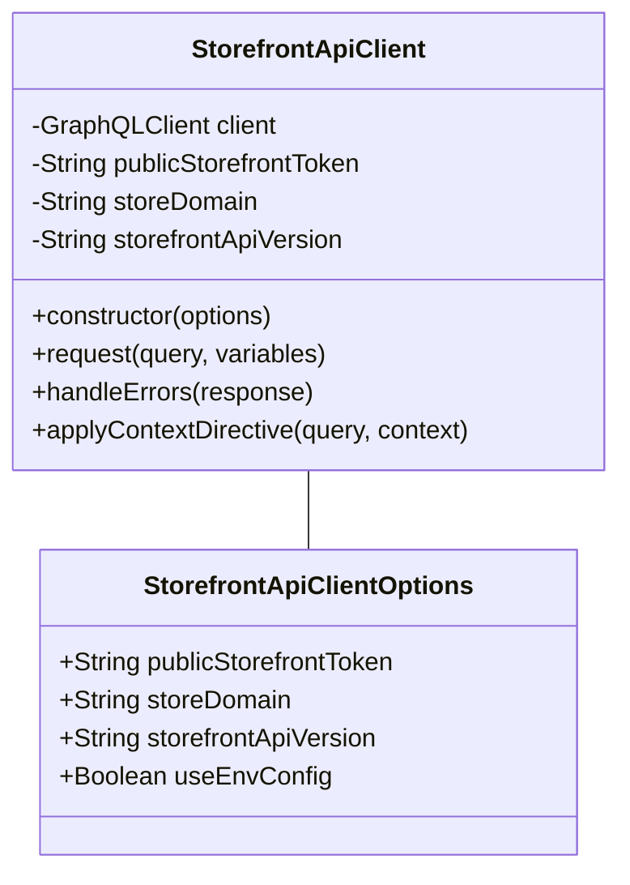
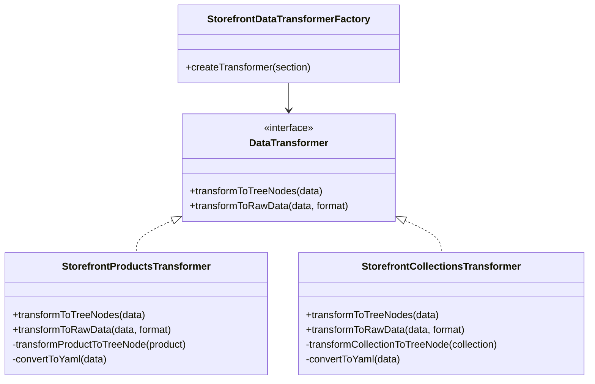
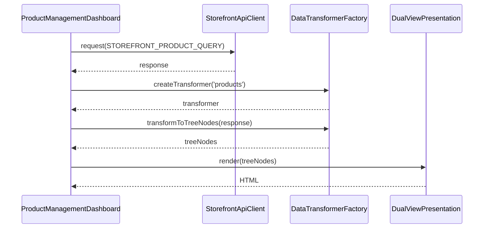

# Shopify Storefront API Integration Summary

This document provides a comprehensive summary of the Shopify Storefront API integration plan and serves as an index to the detailed implementation guides.

## Overview

The Shopify Storefront API integration project aims to align our dashboard implementation with the Shopify Storefront API's data structure and capabilities. This integration will enable our dashboard to accurately display and interact with Shopify storefront data, ensuring a seamless user experience.

## Key Findings from Analysis

1. **API Structure Alignment**:
   - The dashboard correctly uses GraphQL edges/nodes pattern for data representation
   - Resource types (Products, Collections) align with Storefront API capabilities

2. **Misalignments**:
   - API Client lacks proper GraphQL query construction and authentication
   - Missing support for directives like `@inContext` for localization
   - Inconsistent data structure expectations (totalCount properties)
   - Inadequate error handling for GraphQL errors (which return as 200 OK with error objects)

3. **Data Processing Requirements**:
   - Implement proper authentication with access tokens
   - Structure GraphQL queries correctly with operation names
   - Add comprehensive error handling for both HTTP and GraphQL errors
   - Create data transformers to convert API responses to dashboard-compatible format

## Implementation Guides

The following guides provide detailed implementation instructions for each component of the Storefront API integration:

1. [**Shopify Storefront API Integration Plan**](./Shopify_Storefront_API_Integration_Plan.md)
   - Comprehensive implementation plan with phases, timelines, and deliverables
   - Class diagrams and sequence diagrams for the integration
   - Risk assessment and mitigation strategies

2. [**StorefrontApiClient Implementation Guide**](./StorefrontApiClient_Implementation_Guide.md)
   - Detailed implementation of the StorefrontApiClient class
   - Authentication with Storefront API
   - GraphQL query construction and execution
   - Error handling and context support

3. [**Storefront Data Transformers Guide**](./Storefront_Data_Transformers_Guide.md)
   - Implementation of data transformers for each resource type
   - Handling GraphQL edges/nodes pattern
   - Relationship management between resources
   - Pagination handling

4. [**Storefront GraphQL Queries Guide**](./Storefront_GraphQL_Queries_Guide.md)
   - GraphQL query definitions for each resource type
   - Context-aware queries with the `@inContext` directive
   - Pagination implementation
   - Error handling for GraphQL responses

5. [**Dashboard Storefront Integration Guide**](./Dashboard_Storefront_Integration_Guide.md)
   - Updating the ProductManagementDashboard to use StorefrontApiClient
   - Implementing proper error handling
   - Handling unsupported features
   - UI updates for Storefront API capabilities

6. [**Storefront API Integration Testing Guide**](./Storefront_API_Integration_Testing_Guide.md)
   - Unit testing for StorefrontApiClient and data transformers
   - Integration testing for dashboard components
   - End-to-end testing with real Storefront API
   - Performance and security testing

## Implementation Roadmap

The implementation is structured into five phases:

### Phase 1: Storefront API Client Implementation (Week 1)
- Create StorefrontApiClient class
- Implement authentication with Storefront API
- Add support for context directives
- Implement error handling

### Phase 2: Data Structure Alignment (Week 2)
- Create Storefront resource type interfaces
- Implement data transformers for each resource type
- Update DataTransformerFactory

### Phase 3: Query Definition and Implementation (Week 3)
- Create GraphQL query definitions for each resource type
- Implement context-aware queries
- Add pagination support

### Phase 4: Dashboard Integration (Week 4)
- Update ProductManagementDashboard to use StorefrontApiClient
- Implement error handling and notifications
- Update dashboard sections to align with Storefront API capabilities

### Phase 5: Testing and Optimization (Week 5)
- Create comprehensive test suite
- Optimize performance for large datasets
- Implement caching strategy
- Finalize documentation

## Key Components

### StorefrontApiClient

### Data Transformers

### Dashboard Integration

## Risks and Mitigation

| Risk | Impact | Mitigation |
|------|--------|------------|
| Storefront API rate limits | Could cause dashboard to fail during heavy usage | Implement caching, rate limit monitoring, and backoff strategy |
| API version changes | Could break dashboard functionality | Design version-aware client, monitor Shopify changelog |
| Missing capabilities in Storefront API | Some dashboard features may not be possible | Clearly document limitations, provide alternative workflows |
| Performance with large datasets | Dashboard could become slow | Implement pagination, virtualization, and optimized queries |
| Authentication complexity | Security issues or token expiration | Implement proper token management and refresh logic |

## Next Steps

1. Begin implementation of Phase 1 (StorefrontApiClient)
2. Set up test environment with a development Shopify store
3. Create initial unit tests for StorefrontApiClient
4. Schedule weekly progress reviews to track implementation against the roadmap

## Conclusion

This Storefront API integration project will significantly improve our dashboard's compatibility with Shopify's data structure and capabilities. By following the implementation guides and roadmap, we will create a robust, efficient, and accurate dashboard that leverages the full capabilities of the Storefront API while addressing the current misalignments.